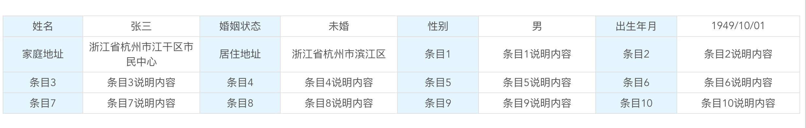

### 说明

#### 报告类内容展示 table

- 数据格式如下：

```
[
  { label: '姓名', content: '张三' },
  { label: '婚姻状态', content: '未婚' },
  { label: '性别', content: '男' },
  { label: '出生年月', content: '1949/10/01' },
  { label: '家庭地址', content: '浙江省杭州市江干区市民中心' },
  { label: '居住地址', content: '浙江省杭州市滨江区' },
  { label: '条目1', content: '条目1说明内容' },
  { label: '条目2', content: '条目2说明内容' },
  { label: '条目3', content: '条目3说明内容' },
  { label: '条目4', content: '条目4说明内容' },
  { label: '条目5', content: '条目5说明内容' },
  { label: '条目6', content: '条目6说明内容' },
  { label: '条目7', content: '条目7说明内容' },
  { label: '条目8', content: '条目8说明内容' },
  { label: '条目9', content: '条目9说明内容' },
  { label: '条目10', content: '条目10说明内容' }
]
```

- 展示效果
  

### Install

```shell
npm install vue-xblz-ui -S
```

### 快速集成

```javascript
import Vue from 'vue';
import XblzComponents from 'vue-xblz-ui';

Vue.use(XblzComponents);

// or
import { Table } from 'vue-xblz-ui';

Vue.component(Table.name, Table);
```

```vue
<xblz-table
  :data="[{ label: '姓名', value: '张三' }]"
  :colCount="4"
  tableLineColor="#dfdfdf"
  labelProp="label"
  labelFontColor="black"
  labelBgColor="#efefef"
  labelAlign="center"
  labelWidth="50%"
  contentProp="content"
  contentFontColor="#000000"
  contentBgColor="#ffffff"
  contentAlign="left"
></xblz-table>
```

### 参数说明

```
data : 展示内容，默认[]
colCount : 行展示列数，默认4
tableLineColor : table分割线颜色，默认#e8e8e8

labelProp : label取值字段，默认：label
labelFontColor : label文字颜色，默认#666666
labelBgColor : label背景色，默认#e9f7fe
labelAlign : label内容位置，可选值left、center、right，默认：center
labelWidth : label宽度，可选值单位px、%，默认120px

contentProp : content取值字段，默认：label
contentFontColor : content文字颜色，默认#666666
contentBgColor : content背景色，默认#ffffff
contentAlign : content内容位置，可选值left、center、right，默认：center
```
